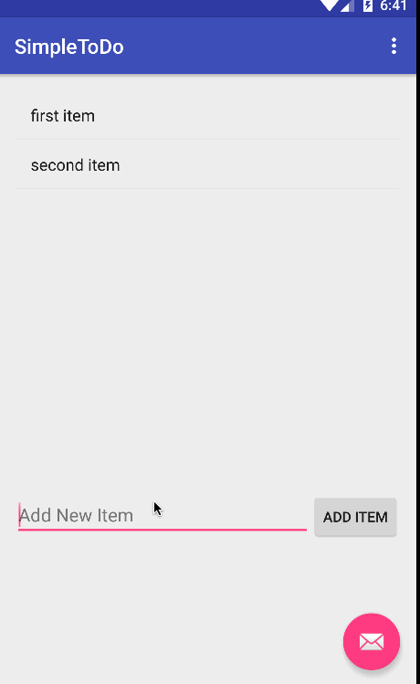

# SimpleToDo app demo

(Sample of your weekly project submission README)

This is an Android demo application for the todo list application using the 

Time spent: 4 hours spent in total

Completed user stories:

 * [x] Required: User can view a list of items
 * [x] Required: User can add new items to the list
 * [x] Required: User can delete items using long press
 * [x] Required: User can edit an item by clicking it

Notes:

Walkthrough of all user stories:

GIF created with [LiceCap](http://www.cockos.com/licecap/).

